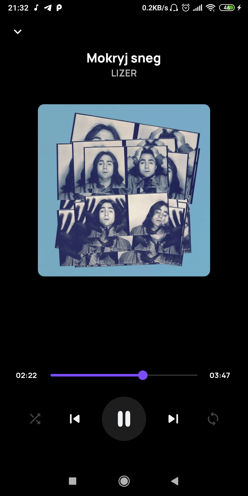
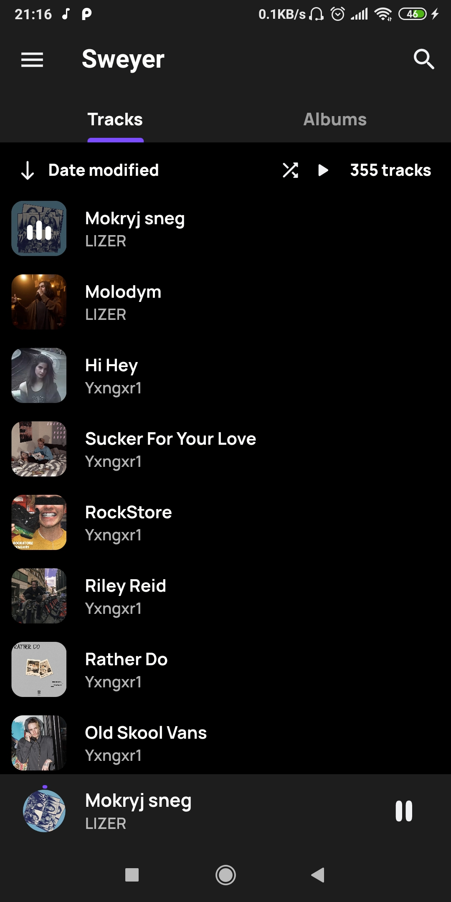
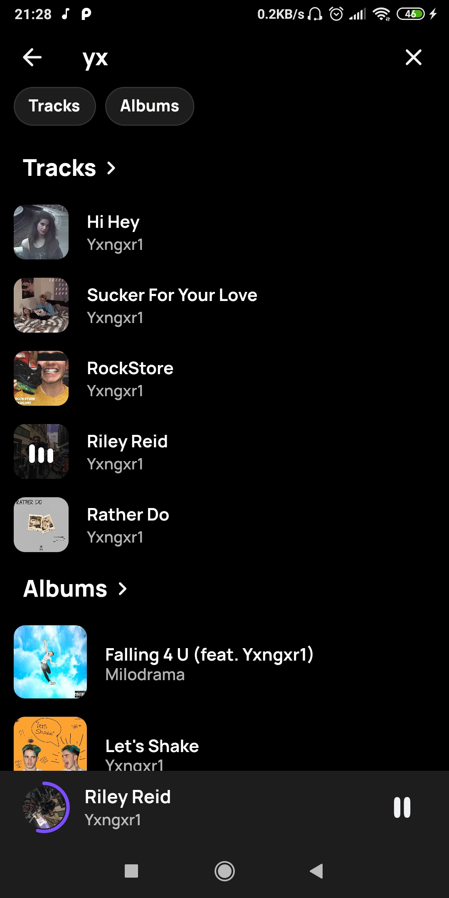
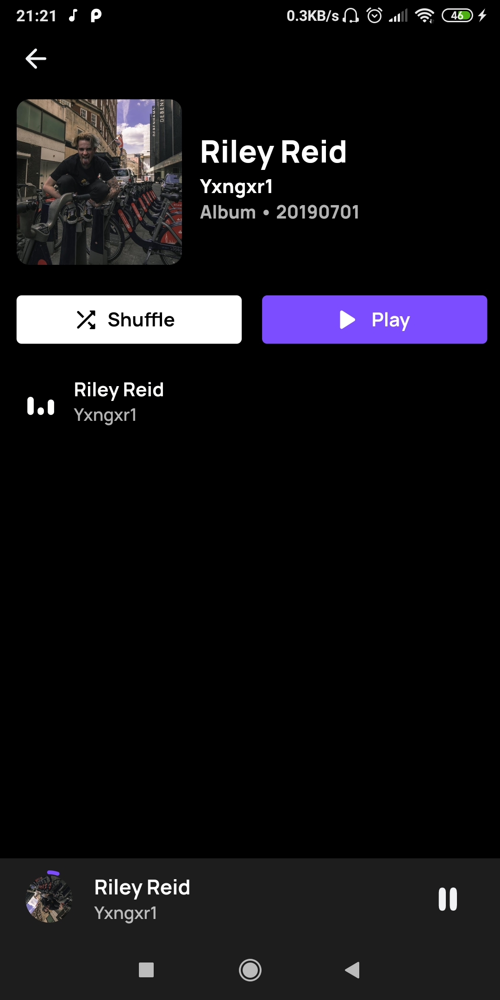

An open-source non-commercial music player built with Flutter

For the time being it's Android-only and I have no plans to support other platforms, however
I don't mind accepting someone's PR tweaking this

